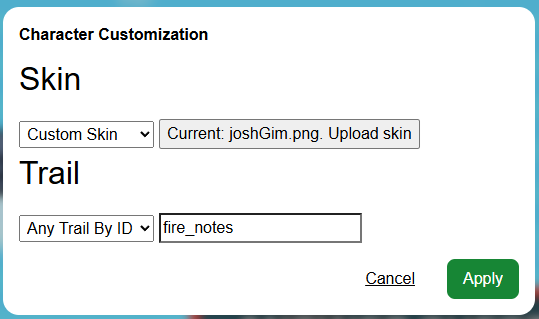

# Character Customization

This plugin lets you pick your Gim's skin and trail for any 2d gamemode. You can even use custom skins!

## Installation

Click on [this link](https://thelazysquid.github.io/gimloader/?installUrl=https://raw.githubusercontent.com/TheLazySquid/Gimloader/main/plugins/CharacterCustomization/build/CharacterCustomization.js) to install the plugin with Gimloader downloaded.

## Usage

Press alt + c to open the customization menu. From there, there are options for skins and for trails.

Skins:
- Unchanged: Doesn't change what skin you have.
- Any Skin by ID: Changes your skin to the skin with the ID you provide. Ids can be found on the [Gimkit Wiki](https://gimkit.wiki/wiki/Gims).
- Custom Skin: Allows you to upload a custom skin. This is designed to work with [my skin creation tool](https://thelazysquid.github.io/gimCreator/).

Trails:
- Unchanged: Doesn't change what trail you have.
- Any Trail by ID: Changes your trail to the trail with the ID you provide. Ids can be found on the [Gimkit Wiki](https://gimkit.wiki/wiki/Trails).

You can find the spritesheet for the Josh Gim [here](./skins/joshGim.png). Go wild.